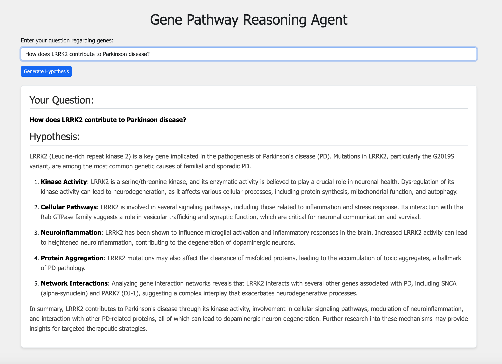

# Gene Pathway Reasoning Agent 
### A Brief Report

## 1. Introduction

The Reasoning Agent is designed to revolutionize biomedical research by automating the extraction and integration of structured knowledge from multiple databases. Using state-of-the-art generative AI and natural language processing techniques, the system parses KEGG pathway files (KGML) and Gene Ontology (GO) annotation data to enable dynamic querying of gene-disease relationships. The goal is to empower researchers and healthcare professionals by significantly reducing literature review time and enhancing data-driven hypothesis generation.

## 2. Methodology

The workflow comprises the following core steps:
- **Data Extraction:**  
  - **KEGG Pathways:** We parse KGML files for four disease-specific pathways:  
    - Type II diabetes mellitus
    - Alzheimer disease
    - Parkinson disease
    - Colorectal cancer  
  - **Gene Ontology:** The Homo sapiens Gene Association File is processed to extract gene-to-GO term relationships.
  
- **Data Integration:**  
  Extracted genes and their associated biochemical reactions, interactions, and GO annotations are integrated into a relational knowledge graph. This provides the foundation for cross-referencing information between KEGG pathways and functional annotations.

- **LLM-Powered Agent:**  
  A generative AI agent is employed to interpret natural language queries. The agent leverages the structured data to generate informed hypotheses about gene involvement in disease pathways. It supports multi-gene queries and network analysis, predicting downstream interactions based on the integrated data.

## 3. Example Queries and Hypotheses

Below are several examples showcasing the system’s capabilities:

### Example 1: Type II Diabetes Mellitus

### Example 2: Alzheimer Disease

### Example 3: Parkinson Disease

### Example 4: Colorectal Cancer

## 4. Limitations and Future Work

**Data Completeness**
- The KGML and GAF files, while comprehensive, might not capture all nuances of gene–disease relationships.
- Some gene annotations or pathway interactions may be outdated or incomplete.

**Hypothesis Validation**
- Generated hypotheses are based on available structured data and should be experimentally validated.
- Integration of additional data sources (e.g., recent literature, clinical trial databases) could improve accuracy.

**System Scalability & Flexibility**
- The current approach is designed for a defined set of pathways. Scaling to additional diseases or incorporating more dynamic data sources could be challenging.

**LLM Reasoning**
- The agent’s reasoning is limited by the quality of training data and available annotations, which may introduce biases or oversimplifications.

**Future Work**
- Integration of Evaluation Personas: Introduce evaluation personas that simulate various end-user profiles (e.g., clinical researchers, bioinformaticians, healthcare professionals) to systematically assess and provide feedback on the LLM’s performance and hypothesis quality.
- Enhance the system’s ability to incorporate multi-perspective evaluations for continuous improvement.

## 5. Conclusion

This report demonstrates an innovative and robust agentic workflow that integrates KEGG pathway data with GO annotations to generate targeted hypotheses. The system efficiently supports diverse queries—from single-gene associations to multi-gene interaction analyses, enabling researchers to gain detailed, actionable insights into disease mechanisms. With promising opportunities for further enhancement, this approach sets the stage for increasingly sophisticated applications in biomedical research and precision medicine.